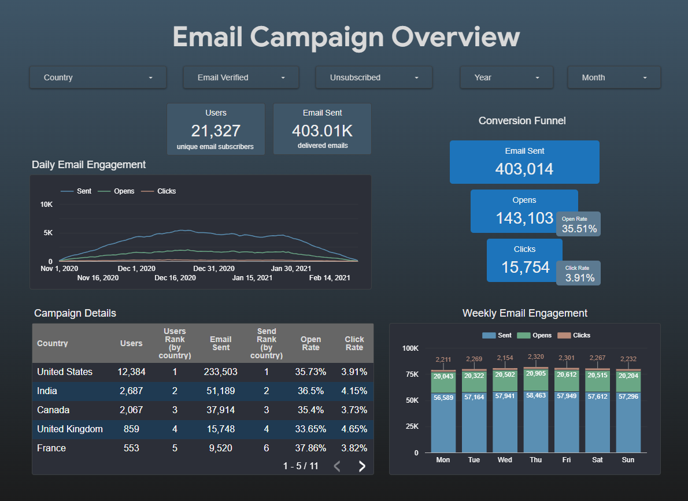

# Email Engagement Dashboard powered by BigQuery & Looker Studio

This repository contains a BigQuery SQL query powering a Looker Studio dashboard that visualizes email campaign performance across countries and over time.

🔗 [View dashboard in Looker Studio](https://lookerstudio.google.com/reporting/7a1aa906-be17-4863-9962-dbdeac514029)

## 📊 Dashboard Highlights

The dashboard includes:

### 📍 Country-level breakdown

- `users` — number of unique email subscribers per country  
- `email sent` — total emails sent per country  
- `users rank` — country rank by subscriber count  
- `send rank` — country rank by sent emails

### 📈 Time-based dynamics

- Daily trend of `sent`, `opens`, and `clicks` in line chart  
- Weekly engagement bar chart segmented by `sent`, `opens`, and `clicks`

### 🔁 Conversion funnel

- Emails Sent → Opens → Clicks  
- Calculated rates:  
  - `open rate` = COUNT_DISTINCT(open_id_message) / COUNT_DISTINCT(sent_id_message)  
  - `click rate` = COUNT_DISTINCT(visit_id_message) / COUNT_DISTINCT(sent_id_message)

### 👥 User segmentation fields

- `email verified` = CASE is_verified WHEN '1' THEN 'Yes' WHEN '0' THEN 'No'  
- `unsubscribed` = CASE is_unsubscribed WHEN '1' THEN 'Yes' WHEN '0' THEN 'No'

### 📅 Date breakdown fields

- `day_of_week_name` = CASE WEEKDAY(date) → Mon–Sun  
- `day_of_week_num` = WEEKDAY(date) — for sorting in bar chart  
- `month` = CASE EXTRACT(MONTH FROM date) → Jan–Dec  
- `year` = EXTRACT(YEAR FROM date)

### 🧩 Filters available

- country  
- email verified  
- unsubscribed  
- year  
- month

## 🎨 UX-focused design

- Dashboard is optimized for dark backgrounds with high-contrast, harmonious colors  
- Color palette selected for accessibility, clarity, and emotional tone  
- Bilingual labels and intuitive sorting enhance user experience

**Color palette used:**

| Element / Metric         | Hex Code   | Usage Description                                 |
|--------------------------|------------|---------------------------------------------------|
| Sent (daily dynamics)    | `#5A8FB3`  | Blue-gray — used in daily `sent_msg` line chart and weekly bars |
| Funnel accent            | `#1D74BB`  | Bright blue — main highlight in conversion funnel |
| Open (daily dynamics)    | `#6AA785`  | Green — opens in daily line chart and weekly bars |
| Click (daily dynamics)   | `#B98C7A`  | Brown — clicks in daily line chart and weekly bars |
| Open/Click Rate          | `#5C7A91`  | Gray — used for percentage indicators in table    |

**Dark background layers:**

| Layer / Depth            | Hex Code   | Usage                                             |
|--------------------------|------------|---------------------------------------------------|
| Panel background         | `#3F5668`  | Main chart containers                             |
| Section background       | `#374856`  | Table and filter zones                            |
| Canvas base              | `#2C2F38`  | Overall dashboard background                      |
| Deep background          | `#1C1D1D`  | Outer frame / page base                           |

## 🛠️ Technologies Used

- **Google BigQuery** — for scalable SQL querying and data transformation  
- **Looker Studio** — for interactive dashboard design and visualization

## 📁 Files

- `email_engagement_dashboard.sql` — main query powering the dashboard

## ✍️ Author

Created by [Nataliia](https://www.linkedin.com/in/nataliia-hrushko/)  
Supporting clear decisions through data from HR systems to SQL dashboards.  
Driven by analytics, data quality, and collaborative growth.
